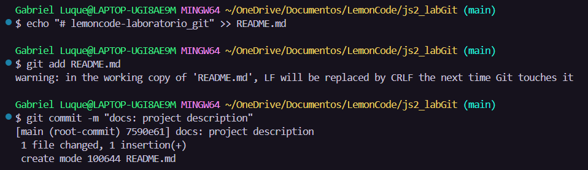
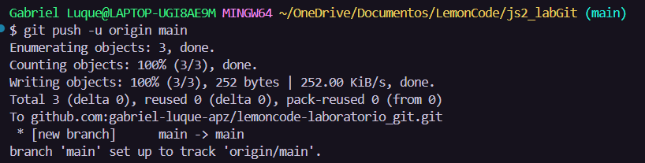
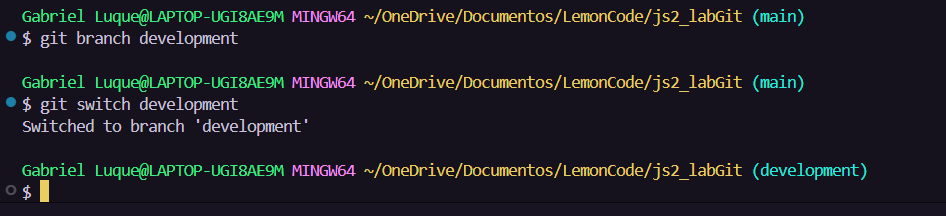
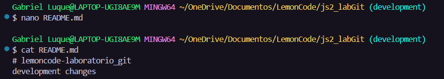
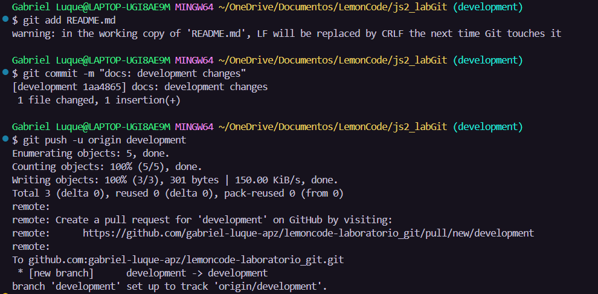

# Descripción del laboratorio

## Crear un repositorio en local

- Abre tu terminal y navega hasta el directorio donde deseas crear el repositorio.
- Crea una carpeta con el nombre del repositorio (js2_labGit).
- Ingresa a la carpeta que acabas de crear.
- Inicializa el repositorio de Git.


## Subir el repositorio a GitHub

- Crea un nuevo repositorio en GitHub.


- Copia el URL del repositorio que acabas de crear en GitHub
- Conecta tu repositorio local con el repositorio en GitHub.
```sh
    git remote add origin git@github.com:gabriel-luque-apz/lemoncode-laboratorio_git.git
```
- Verifica que la conexión se haya establecido correctamente.


## Hacer un commit y un push

- Crea un archivo en la carpeta del repositorio.
- Añade el archivo al staging.
- Crea un commit con un mensaje descriptivo.



- Sube los cambios al repositorio en GitHub.



## Crear una rama

- Crea una rama nueva llamada "development".
- Cambia a la nueva rama.



- Realiza algunos cambios en el archivo que creaste.



- Añade y haz un commit con los cambios en la rama "development".
- Sube los cambios a Github.

